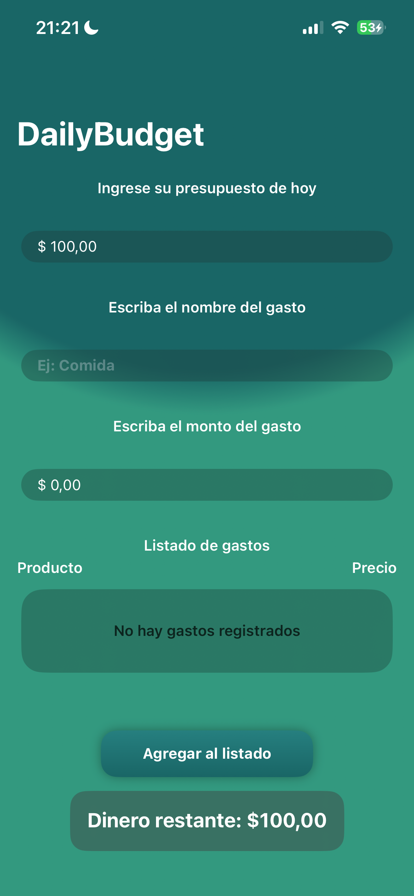
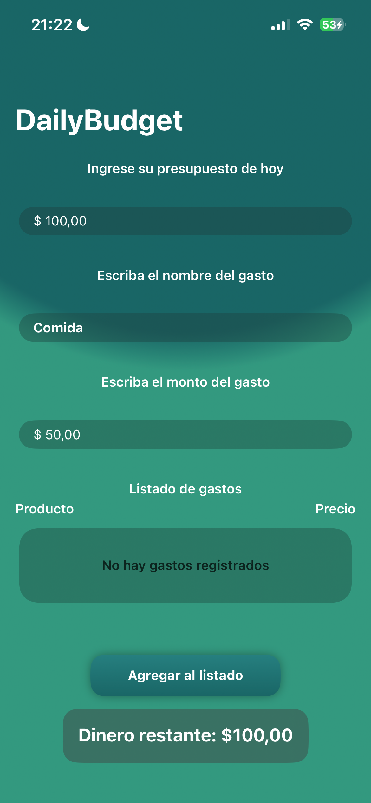
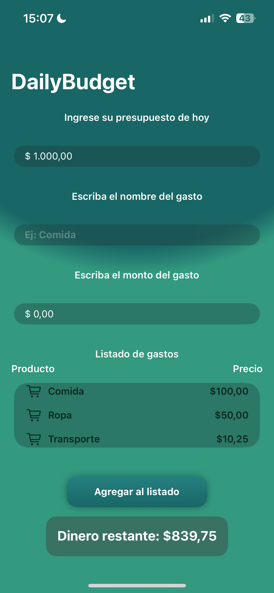

# DailyBudget 📱💸

DailyBudget is a simple iOS app built with **SwiftUI** that helps users manage their **daily budget** by tracking expenses throughout the day.

This project is part of my learning journey in iOS development, following the **100 Days of SwiftUI** course by *Hacking with Swift*.

---

## ✨ Features

- Enter a daily budget
- Add expenses with name and amount
- Display expenses in a scrollable list
- Automatically calculate remaining money
- Real-time UI updates based on user input

---

## 🛠️ Technologies Used

- Swift
- SwiftUI
- State management with `@State`
- Reactive UI updates
- `NavigationStack`, `ScrollView`, `VStack`, `HStack`
- `FocusState` for better keyboard handling
- Custom `ViewModifier` for reusable styles

---

## 📚 What I Learned

- Managing state and reactive updates in SwiftUI
- Building reusable UI components
- Using computed properties for dynamic calculations
- Handling user input and basic validations
- Structuring a complete SwiftUI view

---

## 🚀 Possible Future Improvements

- Separate business logic using MVVM
- Data persistence (UserDefaults or Core Data)
- Edit and delete expenses
- Improve UI and accessibility
- Support for multiple days

---

## 📷 Screenshots

---

## 🎥 Demo Video

[Watch demo video](screenshots/demo.mp4)

---

## 👨‍💻 Author

Facundo Vogel  
Junior iOS Developer — Learning SwiftUI by building projects
